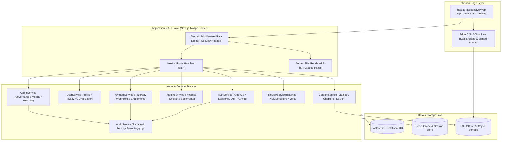
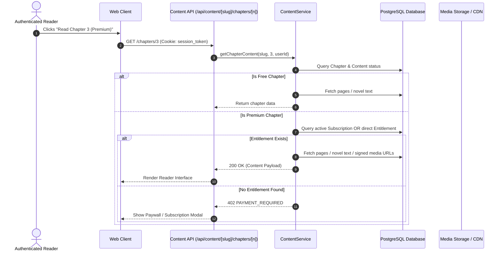

# System Architecture & Technical Design

This document details the software architecture, design patterns, data flows, and component responsibilities of the Omniverse digital content distribution platform.

---

## 1. High-Level Architectural Diagram



---

## 2. Layered Service Architecture

The system follows a strict Clean Architecture pattern separating concerns into modular domains:

### 2.1 Interface Layer (`src/app/`)
- **App Router Pages**: Fast Server Components for static catalog discovery, and dynamic Client Components for interactive readers (comic zoom/scroll, novel typography, audio controls).
- **API Route Handlers (`src/app/api/*`)**: RESTful endpoints processing incoming JSON requests, performing cookie and header extraction, and returning unified JSON envelopes via `apiSuccess()` or `handleApiError()`.

### 2.2 Domain Service Layer (`src/services/*`)
All business logic is isolated in stateless, testable service classes:
- **`AuthService`**: Manages credential registration, Argon2id verification, phone OTP flows with database timestamps, session tokens, and OAuth identity linking.
- **`ContentService`**: Queries published catalog items, calculates full-text query matching, and evaluates whether a requesting user has entitlement to read a given chapter.
- **`ReadingService`**: Manages reading and listening progress, updates library shelves automatically when reading starts, and supports bookmark notes.
- **`PaymentService`**: Interfaces with the payment provider, verifies HMAC-SHA256 signatures server-side, provisions entitlements idempotently, and issues refunds.
- **`UserService`**: Handles user profile attributes, privacy controls, GDPR data exports, and legal-compliant account anonymization.
- **`AuditService`**: Logs all sensitive security and financial events with automatic redaction of secrets, passwords, tokens, and PII.
- **`AdminService`**: Provides administrative intelligence, platform metrics, moderation, and user role management.

### 2.3 Persistence Layer (`src/lib/db.ts` & `prisma/schema.prisma`)
- **Database Abstraction (`DbClient`)**: A unified SQL interface that seamlessly operates against production PostgreSQL clusters via `pg.Pool` or local embedded zero-config WebAssembly instances via `@electric-sql/pglite`.
- **Relational Integrity**: Strict foreign keys, compound indexes, cascades on non-financial entities, and immutable financial ledgers.

---

## 3. Core Interaction Flows

### 3.1 Content Entitlement & Access Flow


### 3.2 Secure Payment & Entitlement Provisioning
```mermaid
sequenceDiagram
    autonumber
    actor User as Customer
    participant Web as Checkout Modal
    participant API as Payment API
    participant Razorpay as Payment Gateway
    participant Svc as PaymentService
    participant DB as PostgreSQL

    User->>Web: Selects Monthly Plan ($9.99)
    Web->>API: POST /api/payments/orders { plan: "MONTHLY_PREMIUM" }
    API->>Svc: createSubscriptionOrder(userId, plan)
    Svc->>Razorpay: Create Order with server secret
    Razorpay-->>Svc: Order ID (order_xyz)
    Svc->>DB: INSERT into "Order" (PENDING)
    Svc-->>API-->>Web: Order parameters (key_id, order_id, amount)
    
    Web->>Razorpay: Customer completes payment on checkout
    Razorpay-->>Web: payment_id & razorpay_signature
    
    Web->>API: POST /api/payments/verify { orderNumber, paymentId, signature }
    API->>Svc: verifyPayment(input)
    Svc->>Svc: Compute HMAC-SHA256(orderId + "|" + paymentId, secret)
    Svc->>Svc: crypto.timingSafeEqual(expected, signature)
    
    alt Signature Valid
        Svc->>DB: Begin Transaction
        Svc->>DB: UPDATE "Order" SET status = 'SUCCESS'
        Svc->>DB: INSERT into "Payment" (Captured)
        Svc->>DB: UPSERT into "Subscription" (ACTIVE, expiry = NOW() + 30d)
        Svc->>DB: Commit Transaction
        Svc-->>API-->>Web: { success: true, entitlement: "ACTIVE" }
    else Signature Invalid
        Svc-->>API: 400 Bad Request ("Signature verification failed")
    end
```

---

## 4. Scalability & Resilience Patterns

1. **Stateless Edge Handlers**: All API route handlers are stateless, enabling multi-region container deployments across Kubernetes, AWS ECS, or Vercel.
2. **Read-Heavy Query Optimization**:
   - Incremental Static Regeneration (ISR) on discovery feeds.
   - Compound indexes on `(status, contentType, viewCount)` and `(contentId, chapterNumber)`.
3. **Short-Lived Signed Media URLs**: Object storage resources (comic images, audiobook streams) are never served via public static URLs. The backend issues pre-signed S3/CDN URLs with 15-minute expirations upon entitlement verification.
4. **Resilient Local Development**: The architecture includes auto-detecting embedded WebAssembly PostgreSQL (`PGlite`), allowing new developers or CI runners to execute full integration suites without provisioning an external database server.
