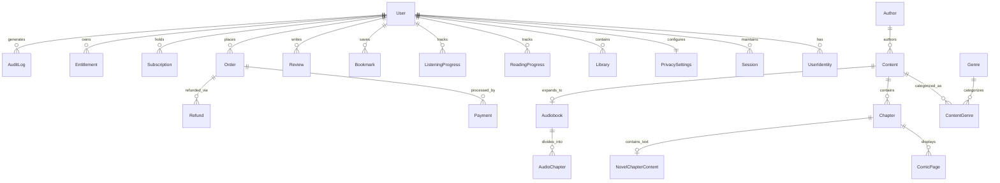

# Database Architecture & Schema Specification

The Omniverse database is designed with strong relational constraints, ACID compliance, compound performance indexes, and strict financial ledger integrity.

---

## 1. Entity-Relationship Overview

---

## 2. Table Specifications & Constraints

### 2.1 User & Identity Tables
- **`User`**: Primary account record.
  - Columns: `id` (UUID PK), `email` (Unique Nullable), `phone` (Unique Nullable), `passwordHash` (Argon2id), `name`, `username` (Unique Nullable), `role` (`USER`, `MODERATOR`, `ADMIN`), `status` (`ACTIVE`, `SUSPENDED`, `DELETED`), `emailVerified`, `phoneVerified`, `createdAt`, `updatedAt`.
  - Indexes: `idx_user_email`, `idx_user_phone`, `idx_user_role_status`.
- **`UserIdentity`**: Multi-provider identity mapping (email, google, phone).
  - Columns: `id`, `userId` (FK User CASCADE), `provider` (`EMAIL`, `GOOGLE`, `PHONE`), `providerUserId`, `providerEmail`, `metadata` (JSONB).
  - Constraints: `UNIQUE("provider", "providerUserId")`.
- **`Session`**: Device-level login tracking with token revocation support.
  - Columns: `id`, `userId` (FK User CASCADE), `sessionToken` (Unique), `userAgent`, `ipAddress`, `expiresAt`, `createdAt`.
  - Indexes: `idx_session_token_expires`.
- **`PrivacySettings`**: Fine-grained privacy controls.
  - Columns: `id`, `userId` (FK User CASCADE Unique), `isProfilePublic`, `showReadingActivity`, `showReviews`, `allowPersonalization`, `allowAnalytics`, `allowMarketing`, `allowPushAlerts`, `allowPersonalizedAds`.

### 2.2 Content & Editorial Catalog
- **`Author`**: Content creator profiles.
  - Columns: `id`, `name`, `slug` (Unique), `bio`, `avatarUrl`, `isVerified`, `followerCount`.
- **`Genre`**: Taxonomical classifications.
  - Columns: `id`, `name` (Unique), `slug` (Unique), `description`.
- **`Content`**: Core polymorphic content entity.
  - Columns: `id`, `authorId` (FK Author), `title`, `slug` (Unique), `description`, `contentType` (`COMIC`, `NOVEL`, `SHORT_STORY`, `AUDIOBOOK`), `status` (`DRAFT`, `PUBLISHED`, `ARCHIVED`), `coverUrl`, `bannerUrl`, `releaseStatus` (`ONGOING`, `COMPLETED`), `language`, `isPremium`, `priceCents`, `ratingAverage`, `ratingCount`, `viewCount`, `publishedAt`.
  - Indexes: `idx_content_type_status_view`, `idx_content_slug`.
- **`Chapter`**: Sequential chapters.
  - Columns: `id`, `contentId` (FK Content CASCADE), `chapterNumber`, `title`, `slug`, `isPremium`, `priceCents`, `wordCount`, `publishedAt`.
  - Constraints: `UNIQUE("contentId", "chapterNumber")`.

### 2.3 Media & Format Implementations
- **`ComicPage`**: Individual page records for comic chapters.
  - Columns: `id`, `chapterId` (FK Chapter CASCADE), `pageNumber`, `imageUrl`, `width`, `height`.
  - Constraints: `UNIQUE("chapterId", "pageNumber")`.
- **`NovelChapterContent`**: Rich-text / markdown prose content.
  - Columns: `id`, `chapterId` (FK Chapter CASCADE Unique), `textContent`.
- **`Audiobook`**: Audiobook metadata.
  - Columns: `id`, `contentId` (FK Content CASCADE Unique), `narrator`, `totalDurationSeconds`, `sampleAudioUrl`.
- **`AudioChapter`**: Audio tracks for specific chapters.
  - Columns: `id`, `chapterId` (FK Chapter CASCADE Unique), `audioUrl`, `durationSeconds`, `bitRate`.

### 2.4 User Progression & Social Interactions
- **`Library`**: User library shelf mappings.
  - Columns: `id`, `userId` (FK User CASCADE), `contentId` (FK Content CASCADE), `shelf` (`CURRENTLY_READING`, `COMPLETED`, `SAVED`, `PURCHASED`, `AUDIOBOOKS`).
  - Constraints: `UNIQUE("userId", "contentId")`.
- **`ReadingProgress`**: Real-time reader location tracking.
  - Columns: `id`, `userId`, `contentId`, `chapterId`, `pageNumber`, `percentCompleted`, `lastReadAt`.
  - Constraints: `UNIQUE("userId", "contentId")`.
- **`ListeningProgress`**: Audio playback time tracking.
  - Columns: `id`, `userId`, `contentId`, `chapterId`, `positionSeconds`, `durationSeconds`, `lastListenedAt`.
  - Constraints: `UNIQUE("userId", "contentId")`.
- **`Bookmark`**: Saved reading points with user notes.
  - Columns: `id`, `userId`, `contentId`, `chapterId`, `pageNumber`, `audioTimestamp`, `note`.
- **`Review`**: Community critique and 5-star ratings.
  - Columns: `id`, `userId`, `contentId`, `rating` (1–5), `title`, `body`, `helpfulCount`, `isFlagged`.
  - Constraints: `UNIQUE("userId", "contentId")`.

### 2.5 Financial Ledgers & Entitlements
- **`Order`**: Payment transactions.
  - Columns: `id`, `userId`, `orderNumber` (Unique), `type` (`SUBSCRIPTION`, `CHAPTER_PURCHASE`, `CONTENT_PURCHASE`), `amountCents`, `currency`, `status` (`PENDING`, `SUCCESS`, `FAILED`, `REFUNDED`), `providerOrderId`, `metadata` (JSONB).
- **`Payment`**: Captured gateway payments.
  - Columns: `id`, `orderId` (FK Order), `providerPaymentId` (Unique), `amountCents`, `currency`, `status`, `paymentMethod`.
- **`Subscription`**: Active subscription privileges.
  - Columns: `id`, `userId` (FK User), `plan` (`MONTHLY_PREMIUM`, `ANNUAL_PREMIUM`), `status` (`ACTIVE`, `CANCELLED`, `EXPIRED`), `expiryDate`.
- **`Entitlement`**: Granular content access rights.
  - Columns: `id`, `userId` (FK User), `contentId` (Nullable), `chapterId` (Nullable), `source` (`SUBSCRIPTION`, `DIRECT_PURCHASE`, `GIFT`), `expiresAt`.
- **`Refund`**: Audit logs for processed refunds.
  - Columns: `id`, `orderId` (FK Order), `amountCents`, `reason`, `providerRefundId`, `processedBy` (FK User).

---

## 3. Data Retention & Privacy Compliance

| Entity | Retention Policy | Deletion Behavior |
| :--- | :--- | :--- |
| **`User` (PII)** | Deleted upon user request | Email/Phone replaced with anonymized hashes; name cleared; status set to `DELETED`. |
| **`UserIdentity`** | Deleted upon user request | Hard deleted immediately to prevent future login using orphaned provider tokens. |
| **`Session`** | Expiration + 30 days | Hard deleted on logout or session cleanup cron. |
| **`ReadingProgress`** | User lifespan | Hard deleted upon user deletion. |
| **`Order` / `Payment`** | 7 Years (Statutory Tax Compliance) | Retained with non-identifiable UUID link. Never deleted. |
| **`AuditLog`** | 2 Years | Retained for security incident analysis; contains zero PII. |
